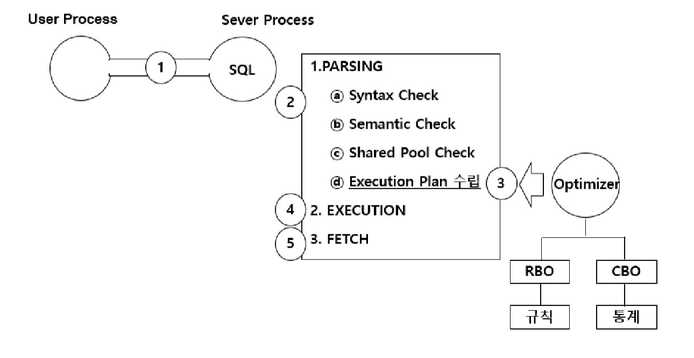

# Statement와 Prepared Statement의 특징

## 1. Prepared Statement란 무엇인가?
Prepared Statement라는 단어를 해석해보면 '준비된 문장' 정도로 해석이 가능하다.  
그런데 무엇이 준비되었다는 뜻일까?  
바로 쿼리가 준비되었다는 의미이다.  
이미 쿼리실행계획 분석과 컴파일이 완료되어서 DBMS의 캐시에 준비되어있는 쿼리를 사용한다는 의미이다.
<br/><br/>

## 2. Prepared Statement VS Statement


  

위 그림은 DBMS가 쿼리를 실행하는 절차이며, 각 부분에서 처리하는 내용은 다음과 같다.

```
1. Parsing (Query의 문법적, 의미적 오류 체크, 재사용 가능 SQL 확인, 쿼리실행계획 수립 등)
2. Execution (쿼리를 실행한다.)
3. Fetch(실행된 값을 가져오는 절차이므로 Select 만 해당됨. 반환하는 값이 없는 Insert, Update, Delete는 미해당.)
```


*Prepared Statement* 
* 장점
    * 1번 처리 구간을 건너 뛰고 2번부터 처리하기 때문에 SQL 처리가 빠르다. (Soft Parsing)
    * 1번 구간은 SQL을 분석하는 처리도 하고 있지만, 건너뛰기 때문에 대입된 값은 SQL로 인식하지 않는다. 즉 SQL Injection을 예방할 수 있다.
* 단점
    * 쿼리에 오류가 생긴경우 분석하기 어렵다. 바인드변수 부분이 '?'로 나오므로 실제 실행된 쿼리를 확인하는것이 어렵다.
    * 바인드변수는 일부 허용된 위치에서만 사용할 수 있기 때문에 동적 쿼리 작성이 힘들다.  
    한가지 예로 변수를 활용해 동적으로 테이블을 변경하는 쿼리를 작성해야 하는 경우 Prepared Statement로는 처리가 불가능하다.

*Statement*
* 장점
    * 테이블, 컬럼에 대한 동적 쿼리 작성이 가능하다. 즉 DDL 작성에 적합하다.
    * 쿼리실행문을 직접 확인 가능하므로 쿼리 분석이 쉽다.

* 단점
    * 1번 처리구간을 매 요청마다 수행하므로 Query 처리비용이 더 들게된다.  
    즉 캐시 활용을 하지 못한다는 얘기이다.
    * 위와는 반대로 SQL Injection으로 인한 공격에 노출된다. 
    예를 들자면 비밀번호를 확인하는 Where 구문의 변수 부분에 '1234 OR 1 = 1'  같은 구문을 끼워넣을 경우 항상 참이 되어버리므로 악용이 가능하다.

<br/><br/>

## 3. 결론
Statement는 DDL(CREATE, ALTER, DROP) 구문을 처리할 때 적합하다.  
매 실행시 쿼리실행계획을 다시 세우기 때문에 속도가 느리며, SQL Injection공격에 취약하다.

Prepared Statement는 DML(SELECT, INSERT, UPDATE, DELETE)구문 처리에 적합하다.  
그리고 캐시에 저장된 Query를 활용하기 때문에 실행이 빠르며 SQL Injection을 막기 위한 방법으로 활용된다.

<br/><br/>

## Reference
- https://baeldung.com/java-statement-preparedstatement
- https://javarevisited.blogspot.com/2012/03/why-use-preparedstatement-in-java-jdbc.html#axzz6vHhIXvQP